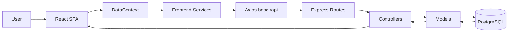

# Architecture

## Architectural Style
- Frontend: SPA with React and context-driven state orchestration.
- Backend: Layered modular API (route -> controller -> model).
- Data layer: PostgreSQL with SQL migrations and direct pg access (no ORM).

## Repository Organization
- SSO/: frontend application.
- backend-SSSO/: backend API + db scripts + docker-compose.
- .github/: permanent AI rules.
- .ai/: technical memory and continuity docs.

## Backend Layers
1. Routes:
- Register endpoints and HTTP verbs.
2. Controllers:
- Request parsing, lightweight validation, error mapping.
3. Models:
- SQL queries, shape transformation, business-level persistence flow.
4. DB connection:
- Shared pg Pool in src/db/connection.js.

## Frontend Layers
1. Pages:
- Dashboard.jsx, MatrizPage.jsx, CatalogosPage.jsx.
2. Components:
- Generic UI + dashboard-specific visual blocks.
3. Context:
- DataContext orchestrates data loading and mutations.
- AuthContext simulates local identity state.
4. Services:
- Axios wrappers per domain.
5. Utils:
- Validation, formatting, risk calculations.

## Data Communication
- Vite proxy forwards /api requests to http://localhost:3000.
- JSON payloads over HTTP.
- Backend returns either object-wrapped or direct arrays depending on endpoint.

## Information Flow Diagram

## Backend Module Map
- Catalog structure:
  - sub-direcciones
  - departamentos
  - servicios
  - puestos
  - funciones
- Risk catalog:
  - riesgos
  - peligros
- Matrix:
  - evaluaciones + funciones + detalles
- Planificacion
- Dashboard analytics

## Key Structural Decisions
- Keep SQL in model layer for explicit control and migration compatibility.
- Preserve Spanish domain naming to align with business language.
- Keep dashboard aggregation on backend side to reduce frontend computation.

## Current Constraints
- No middleware layer folder currently exists.
- No ORM/repository abstraction beyond model modules.
- No auth middleware and no token verification path.

## Cross References
- Database details: DATABASE.md
- API contracts: API.md
- Backend implementation details: BACKEND.md
- Frontend implementation details: FRONTEND.md
