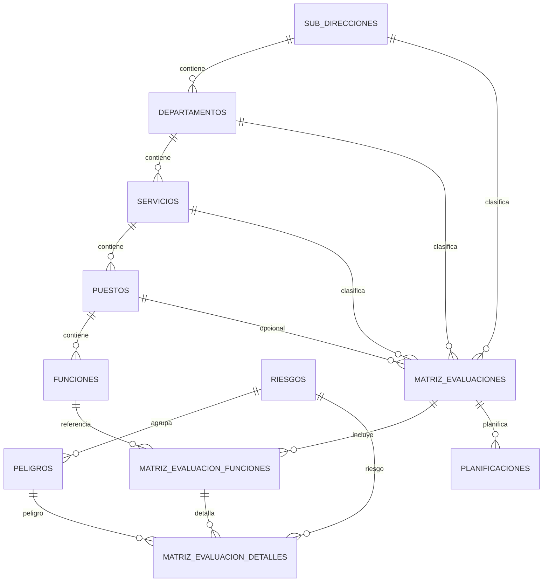

# Database

## Engine And Access
- Engine: PostgreSQL 15 (docker image postgres:15-alpine).
- Connection config source: backend-SSSO/.env.example.
- Access library: pg Pool via backend-SSSO/src/db/connection.js.

## Main Schema (Current Runtime Focus)
Core organizational catalogs:
- sub_direcciones
- departamentos (fk -> sub_direcciones)
- servicios (fk -> departamentos)
- puestos (fk -> servicios)
- funciones (fk -> puestos)

Risk catalogs:
- riesgos
- peligros (fk -> riesgos)

Risk matrix (current hierarchical model):
- matriz_evaluaciones
- matriz_evaluacion_funciones (fk -> matriz_evaluaciones, fk -> funciones)
- matriz_evaluacion_detalles (fk -> matriz_evaluaciones, fk -> matriz_evaluacion_funciones, fk -> riesgos, fk -> peligros)

Planning:
- planificaciones (fk -> matriz_evaluaciones)

Legacy support table:
- matriz_riesgos (historical/original model used by init and migration source).

## Entity Relationship (Simplified)

## Constraints And Validations
- Numeric checks:
  - probabilidad and consecuencia in [1..5].
- State constraints:
  - estado in ('pendiente', 'en proceso', 'completado') for matrix/planning entities.
- Foreign keys enforce catalog integrity with RESTRICT or CASCADE depending on relation.
- Additional text length checks exist in legacy matriz_riesgos for key text fields.

## Indexes (Notable)
- matriz_evaluaciones: fecha, estado.
- matriz_evaluacion_detalles: evaluacion_id, riesgo_id, peligro_id, evaluacion_funcion_id.
- matriz_evaluacion_funciones: evaluacion_id, funcion_id.
- Legacy matrix indexes in migrate_matriz_riesgo_bloques.sql.

## Migration System
Migrations are SQL scripts in backend-SSSO/src/db and executed through npm scripts.
Important migration path:
1. init.sql: initial schema + seed-like bootstrap.
2. migrate_estructura_organizacional.sql: organizational hierarchy.
3. migrate_puestos_funciones_relacion.sql: puestos/funciones structure.
4. migrate_riesgo_peligro_relacion.sql: riesgo-peligro relation.
5. migrate_matriz_maestro_detalle.sql: split matrix into evaluaciones/detalles.
6. migrate_matriz_funciones_jerarquia.sql: insert intermediate evaluacion_funciones layer.

Rollback scripts available:
- rollback_migrate_matriz_maestro_detalle.sql
- rollback_migrate_matriz_funciones_jerarquia.sql
- rollback_migrate_matriz_riesgo_bloques.sql

## Seeders
- No dedicated seeders directory.
- Seed/bootstrap data is embedded in init.sql.

## Persistence Flow
1. Backend model receives payload.
2. Validation and normalization happen in JS model logic.
3. Transactional writes performed for matrix create/update.
4. Read models aggregate joins into frontend-friendly structures.

## Database Inconsistencies To Watch
- Runtime models rely on matriz_evaluaciones/matriz_evaluacion_funciones/matriz_evaluacion_detalles.
- init.sql still seeds matriz_riesgos + planificaciones fk to matriz_riesgos before migration transition.
- Keep migration order explicit in operational runbooks (see DEVOPS.md).

## Cross References
- API contracts using this schema: API.md
- Backend query logic: BACKEND.md
- Runtime setup and scripts: DEVOPS.md
