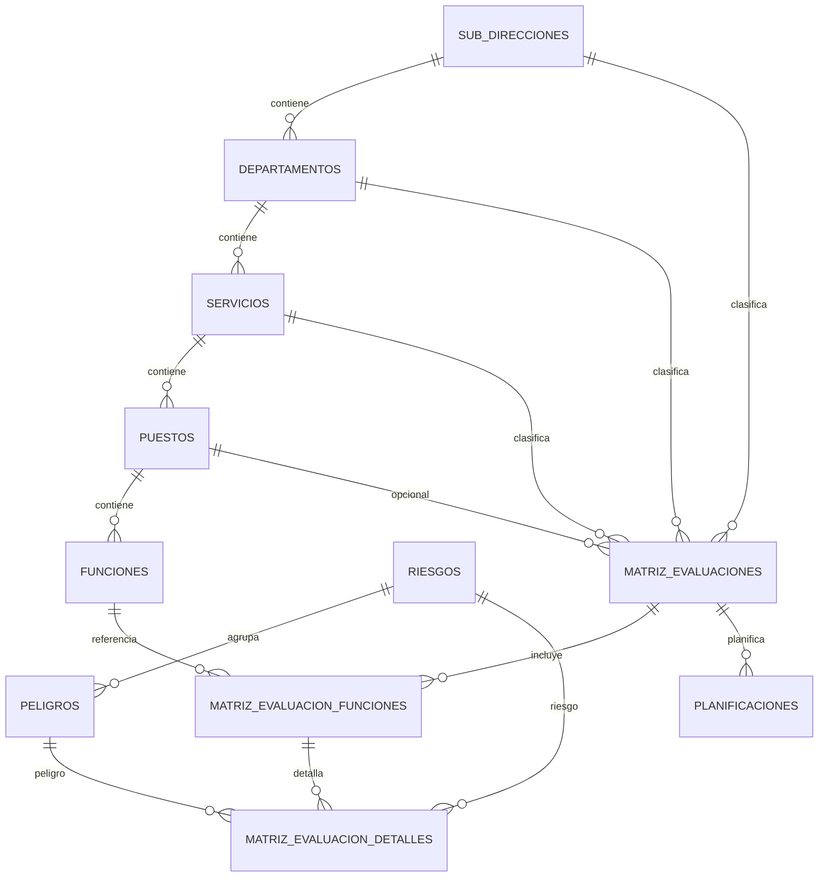

# Database

## Engine And Access
- Engine: PostgreSQL 15 (docker image postgres:15-alpine).
- Connection config source: backend-SSSO/.env.example.
- Access library: pg Pool via backend-SSSO/src/db/connection.js.

## Main Schema (Current Runtime Focus)
Core organizational catalogs:
- sub_direcciones
- departamentos (fk -> sub_direcciones)
- servicios (fk -> departamentos)
- puestos (fk -> servicios)
- funciones (fk -> puestos)

Risk catalogs:
- riesgos
- peligros (fk -> riesgos)

Risk matrix (current hierarchical model):
- matriz_evaluaciones
- matriz_evaluacion_funciones (fk -> matriz_evaluaciones, fk -> funciones)
- matriz_evaluacion_detalles (fk -> matriz_evaluaciones, fk -> matriz_evaluacion_funciones, fk -> riesgos, fk -> peligros)

Planning:
- planificaciones (fk -> matriz_evaluaciones)

Legacy support table:
- matriz_riesgos (historical/original model used by init and migration source).

## Entity Relationship (Simplified)

```mermaid
erDiagram
  SUB_DIRECCIONES ||--o{ DEPARTAMENTOS : contiene
  DEPARTAMENTOS ||--o{ SERVICIOS : contiene
  SERVICIOS ||--o{ PUESTOS : contiene
  PUESTOS ||--o{ FUNCIONES : contiene

  RIESGOS ||--o{ PELIGROS : agrupa

  SUB_DIRECCIONES ||--o{ MATRIZ_EVALUACIONES : clasifica
  DEPARTAMENTOS ||--o{ MATRIZ_EVALUACIONES : clasifica
  SERVICIOS ||--o{ MATRIZ_EVALUACIONES : clasifica
  PUESTOS ||--o{ MATRIZ_EVALUACIONES : opcional

  MATRIZ_EVALUACIONES ||--o{ MATRIZ_EVALUACION_FUNCIONES : incluye
  FUNCIONES ||--o{ MATRIZ_EVALUACION_FUNCIONES : referencia

  MATRIZ_EVALUACION_FUNCIONES ||--o{ MATRIZ_EVALUACION_DETALLES : detalla
  RIESGOS ||--o{ MATRIZ_EVALUACION_DETALLES : riesgo
  PELIGROS ||--o{ MATRIZ_EVALUACION_DETALLES : peligro

  MATRIZ_EVALUACIONES ||--o{ PLANIFICACIONES : planifica
```

## Constraints And Validations
- Numeric checks:
  - probabilidad and consecuencia in [1..5].
- State constraints:
  - estado in ('pendiente', 'en proceso', 'completado') for matrix/planning entities.
- Foreign keys enforce catalog integrity with RESTRICT or CASCADE depending on relation.
- Additional text length checks exist in legacy matriz_riesgos for key text fields.

## Indexes (Notable)
- matriz_evaluaciones: fecha, estado.
- matriz_evaluacion_detalles: evaluacion_id, riesgo_id, peligro_id, evaluacion_funcion_id.
- matriz_evaluacion_funciones: evaluacion_id, funcion_id.
- Legacy matrix indexes in migrate_matriz_riesgo_bloques.sql.

## Migration System
Migrations are SQL scripts in backend-SSSO/src/db and executed through npm scripts.
Important migration path:
1. init.sql: initial schema + seed-like bootstrap.
2. migrate_estructura_organizacional.sql: organizational hierarchy.
3. migrate_puestos_funciones_relacion.sql: puestos/funciones structure.
4. migrate_riesgo_peligro_relacion.sql: riesgo-peligro relation.
5. migrate_matriz_maestro_detalle.sql: split matrix into evaluaciones/detalles.
6. migrate_matriz_funciones_jerarquia.sql: insert intermediate evaluacion_funciones layer.

Rollback scripts available:
- rollback_migrate_matriz_maestro_detalle.sql
- rollback_migrate_matriz_funciones_jerarquia.sql
- rollback_migrate_matriz_riesgo_bloques.sql

## Seeders
- No dedicated seeders directory.
- Seed/bootstrap data is embedded in init.sql.

## Persistence Flow
1. Backend model receives payload.
2. Validation and normalization happen in JS model logic.
3. Transactional writes performed for matrix create/update.
4. Read models aggregate joins into frontend-friendly structures.

## Phase 5C/5D Validation Status
- FASE 5C: complete, recovered and validated.
- FASE 5D: complete and functionally validated.
- Legacy compatibility validated:
  - rows with FK NULL still render legacy text values (`medidasPrev`, `acciones`, `recursos`, `responsable`).
- FK flow validated:
  - catalog -> select -> ID -> API -> FK -> JOIN -> normalized name -> detail.
- Update validation confirmed for evaluations with multiple functions and multiple associated risks after UPDATE.
- Presentation priority validated:
  - normalized name > legacy text > `'-'`.
- Temporary legacy text columns remain in place and are intentionally not removed.
- FASE 5E has not started.

## Database Inconsistencies To Watch
- Runtime models rely on matriz_evaluaciones/matriz_evaluacion_funciones/matriz_evaluacion_detalles.
- init.sql still seeds matriz_riesgos + planificaciones fk to matriz_riesgos before migration transition.
- Keep migration order explicit in operational runbooks (see DEVOPS.md).

## Cross References
- API contracts using this schema: API.md
- Backend query logic: BACKEND.md
- Runtime setup and scripts: DEVOPS.md

## FASE 3A Seed Correction - 2026-09-28
- Target file:
  - backend-SSSO/src/db/seed_riesgos_quimicos_biologicos_ergonomicos.sql
- Backup before change:
  - E:/Backup_SSOHospital/seed_riesgos_quimicos_biologicos_ergonomicos_2026-09-28_pre_fase3a.sql
- Root cause addressed:
  - Several names referenced by relationship blocks did not exist verbatim in base catalogs (`medidas_preventivas`, `acciones`, `recursos`, `responsables`).
  - Because joins are exact by `nombre`, rows in `peligro_medidas` failed to insert and downstream chains (`peligro_medida_acciones`, recursos, responsables) were also partially skipped.
- Correction strategy:
  - Preserve relationship design and control logic already defined in the seed.
  - Add only missing catalog entries used by relation blocks.
  - Keep `INSERT ... ON CONFLICT (nombre) DO NOTHING` for reproducibility and idempotency.
  - No deletion or truncation operations.
- Verification result (static consistency over seed content):
  - Missing references after correction:
    - medidas: 0
    - acciones: 0
    - recursos: 0
    - responsables: 0
  - Target hazards covered in all relation layers:
    - 21 of 21
    - no missing hazards in any of the four link layers.
- Operational note:
  - Corrected seed was intentionally NOT executed during this session.

## Phase 2B/3A - Independent Catalogs Migration (Applied)
- Status: migration script is already applied in database; rollback script remains available for controlled revert.
- Files:
  - backend-SSSO/src/db/migrate_catalogos_independientes.sql
  - backend-SSSO/src/db/rollback_catalogos_independientes.sql
- Backup before migration preparation:
  - E:/Backup_SSOHospital/Pre_Migraciones/SSO_pre_catalogos_2026-09-17_13-35-03.dump
  - SHA256: 146099406E0EDCF436F181C38E12C5CD740D45890A610217D5AFF7B25BBDB660

### New catalogs introduced
- medidas_preventivas
- acciones
- recursos
- responsables

Each table definition includes:
- id SERIAL PRIMARY KEY
- nombre VARCHAR(255) NOT NULL UNIQUE
- created_at TIMESTAMPTZ NOT NULL DEFAULT NOW()
- updated_at TIMESTAMPTZ NOT NULL DEFAULT NOW()

### Matrix transition columns introduced
Added as nullable columns in matriz_evaluacion_detalles:
- medida_preventiva_id INT NULL -> FK medidas_preventivas(id)
- accion_id INT NULL -> FK acciones(id)
- recurso_id INT NULL -> FK recursos(id)
- responsable_id INT NULL -> FK responsables(id)

FK behavior:
- ON UPDATE CASCADE
- ON DELETE RESTRICT

Indexes exist for the four FK columns.

### Compatibility and preservation constraints
- Existing text columns are explicitly preserved (no drop in phase 2B):
  - medidas_prev
  - acciones
  - recursos
  - responsable
- Current backend matrix flow still uses the preserved text columns; FK population is planned for a later transition phase.
- Existing business catalogs must remain intact (no truncate/recreate/delete strategy in migration):
  - sub_direcciones
  - departamentos
  - servicios
  - puestos
  - funciones
  - riesgos
  - peligros
